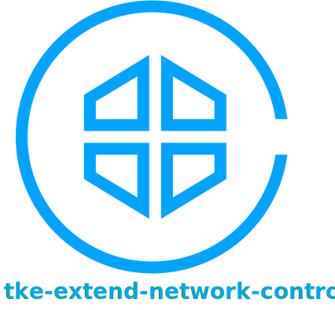

# tke-extend-network-controller

针对 TKE 集群一些特殊场景的的网络控制器。

## 支持房间类场景

目前主要支持会议、游戏战斗服等房间类场景的网络，即要求每个 Pod 都需要独立的公网地址，TKE 集群默认只支持 EIP 方案，但 EIP 资源有限，有申请的数量限制和每日申请的次数限制（参考 [EIP 配额限制](https://cloud.tencent.com/document/product/1199/41648#eip-.E9.85.8D.E9.A2.9D.E9.99.90.E5.88.B6)），稍微上点规模，或频繁扩缩容更换EIP，可能很容易触达限制导致 EIP 分配失败；而如果保留 EIP，在 EIP 没被绑定前，又会收取额外的闲置费。

> TKE Pod 绑定 EIP 参考 [Pod 绑 EIP](https://imroc.cc/tke/networking/pod-eip)。
>
> 关于 EIP 与 CLB 映射两种方案的详细对比参考 [TKE 游戏方案：房间类游戏网络接入](https://imroc.cc/tke/game/room-networking)。

如果不用 EIP，也可通过安装此插件来实现为每个 Pod 的指定端口都分配一个独立的公网地址映射 (公网 `IP:Port` 到内网 Pod `IP:Port` 的映射)。

## 文档

- [安装](./docs/install.md)
- [使用 CLB 为 Pod 分配公网地址映射](./docs/clb-mapping.md)
- [CRD 字段说明](docs/crd.md)
- [API 参考](docs/api.md)
- [Roadmap](docs/roadmap.md)
- [贡献指南](docs/contributing.md)
- [技术亮点](docs/inside.md)

## 项目状态与版本说明

当前项目正处于活跃开发中，请及时更新版本以获得最新能力，参考 [版本说明](CHANGELOG.md)。
