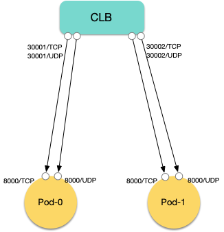

# 使用 CLB 端口池为 Pod 映射公网地址（预览阶段）

## 抢先体验

本文中的功能将在 2.0.0 版本中正式发布，目前处于预览阶段，可通过以下 helm 安装方式测试和体验：

```bash
helm repo add tke-extend-network-controller https://tkestack.github.io/tke-extend-network-controller
helm upgrade --install --devel -f values.yaml \
  --namespace tke-extend-network-controller --create-namespace \
  tke-extend-network-controller tke-extend-network-controller/tke-extend-network-controller
```

`--devel` 参数很重要，其中 `values.yaml` 需配置好以下必要的参数:

```yaml
vpcID: "" # TKE 集群所在 VPC ID (vpc-xxx)
region: "" # TKE 集群所在地域，如 ap-guangzhou
clusterID: "" # TKE 集群 ID (cls-xxx)
secretID: "" # 腾讯云子账号的 SecretID
secretKey: "" # 腾讯云子账号的 SecretKey
```

## CLB 端口池介绍

使用 CLB 为 Pod 分配公网地址映射，首先需要定义 CLB 端口池。

端口池的设计：
1. 每个端口池使用一组相同属性的 CLB，用于为 Pod 分配端口映射。
2. 可以动态追加已有 CLB 实例 ID，也可以在端口不足时自动创建新的 CLB，自动新建的 CLB 的属性可以自定义。
3. 同一个 Pod 的同一个端口可以同时被不同的端口池映射，比如同时被多个单线 IP 的端口池映射来实现多线接入。
4. 支持使用 CLB 端口段映射（1 个 CLB 端口段监听器可映射多个 Pod），可支持大规模场景的映射。
5. 端口池不是 namespaced 资源，无需配置 namespace。

通过创建 CLBPortPool 这个自定义资源来声明端口池，完整的字段说明如下：

```yaml
apiVersion: networking.cloud.tencent.com/v1alpha1
kind: CLBPortPool
metadata:
  name: pool-test # 端口池名称，将会在 Pod 或 Node 注解中被引用
spec:
  startPort: 30000 # 端口池中 CLB 起始端口号
  endPort: 30100 # 可选，端口池的结束端口号。通常只在明确需要限制 CLB 最大端口号时才需要设置，默认情况下会根据当前监听器数量配额和端口分配情况来自动决定。
  segmentLength: 0 # 可选，端口段的长度。仅当值大于 1 时才有效，此时将使用 CLB 端口段监听器来映射（1 个 CLB 监听器可映射 segmentLength 个端口)，结合节点的 HostPort 可实现大规模场景的映射。
  exsistedLoadBalancerIDs: [lb-04iq85jh] # 指定已有的 CLB 实例 ID，可动态追加
  region: ap-guangzhou # 可选，CLB 说在地域的地域代码，如 ap-chengdu，默认使用 TKE 集群说在地域。
  autoCreate: # 可选，自动创建 CLB 的配置，如果不配置，则不会自动创建 CLB
    enabled: true # 是否启用自动创建，如果启用将会在 CLB 端口不足时自动创建 CLB
    maxLoadBalancers: 10 # 可选，限制自动创建的最大负载均衡器数量，默认不限制。
    parameters: # 可选，自动创建 CLB 时购买 CLB 的参数，参考 CreateLoadBalancer 接口: https://cloud.tencent.com/document/api/214/30692
      # 负载均衡实例的网络类型：OPEN：公网属性， INTERNAL：内网属性。默认使用 OPEN（公网负载均衡）。
      loadBalancerType: OPEN
      # 在私有网络内购买内网负载均衡实例的情况下，必须指定子网 ID，内网负载均衡实例的 VIP 将从这个子网中产生。创建内网负载均衡实例时，此参数必填，创建公网IPv4负载均衡实例时，不支持指定该参数。
      subnetId: subnet-k57djpow
      # 负载均衡实例的名称。规则：1-60 个英文、汉字、数字、连接线“-”或下划线“_”。 注意：如果名称与系统中已有负载均衡实例的名称相同，则系统将会自动生成此次创建的负载均衡实例的名称。
      loadBalancerName: test
      # 仅适用于公网负载均衡。目前仅广州、上海、南京、济南、杭州、福州、北京、石家庄、武汉、长沙、成都、重庆地域支持静态单线 IP 线路类型，如需体验，请联系商务经理申请。申请通过后，即可选择中国移动（CMCC）、中国联通（CUCC）或中国电信（CTCC）的运营商类型，网络计费模式只能使用按带宽包计费(BANDWIDTH_PACKAGE)。 如果不指定本参数，则默认使用BGP。可通过 DescribeResources 接口查询一个地域所支持的Isp。
      vipIsp: CTCC
      # 带宽包ID，指定此参数时，网络计费方式（InternetAccessible.InternetChargeType）只支持按带宽包计费（BANDWIDTH_PACKAGE），带宽包的属性即为其结算方式。非上移用户购买的 IPv6 负载均衡实例，且运营商类型非 BGP 时 ，不支持指定具体带宽包id。
      bandwidthPackageId: bwp-40ykow69
      # 性能容量型规格（不同地域的可选规格列表可能不一样，以 CLB 购买页面展示的列表为准）。
      # 若需要创建性能容量型实例，则此参数必填，取值范围：
      # clb.c2.medium：标准型规格
      # clb.c3.small：高阶型1规格
      # clb.c3.medium：高阶型2规格
      # clb.c4.small：超强型1规格
      # clb.c4.medium：超强型2规格
      # clb.c4.large：超强型3规格
      # clb.c4.xlarge：超强型4规格
      # 若需要创建共享型实例，则无需填写此参数。
      slaType: clb.c4.xlarge # 
      # 负载均衡实例计费类型，取值：POSTPAID_BY_HOUR，PREPAID，默认是POSTPAID_BY_HOUR。
      lbChargeType: POSTPAID_BY_HOUR
      # 仅适用于公网负载均衡。负载均衡的网络计费模式。
      internetAccessible:
        # TRAFFIC_POSTPAID_BY_HOUR 按流量按小时后计费 ; BANDWIDTH_POSTPAID_BY_HOUR 按带宽按小时后计费; BANDWIDTH_PACKAGE 按带宽包计费;BANDWIDTH_PREPAID按带宽预付费。注意：此字段可能返回 null，表示取不到有效值。
        internetChargeType: TRAFFIC_POSTPAID_BY_HOUR
        # 最大出带宽，单位Mbps，仅对公网属性的共享型、性能容量型和独占型 CLB 实例、以及内网属性的性能容量型 CLB 实例生效。
        # - 对于公网属性的共享型和独占型 CLB 实例，最大出带宽的范围为1Mbps-2048Mbps。
        # - 对于公网属性和内网属性的性能容量型 CLB实例，最大出带宽的范围为1Mbps-61440Mbps。
        # （调用CreateLoadBalancer创建LB时不指定此参数则设置为默认值10Mbps。此上限可调整）
        internetMaxBandwidthOut: 61440
        # 带宽包的类型，如 SINGLEISP（单线）、BGP（多线）。
        bandwidthpkgSubType: BGP
      # 仅适用于公网负载均衡。IP版本，可取值：IPV4、IPV6、IPv6FullChain，不区分大小写，默认值 IPV4。说明：取值为IPV6表示为IPV6 NAT64版本；取值为IPv6FullChain，表示为IPv6版本。
      addressIPVersion: IPv4
      # 负载均衡后端目标设备所属的网络 ID，如vpc-12345678，可以通过 DescribeVpcs 接口获取。 不填此参数则默认为当前集群所在 VPC。创建内网负载均衡实例时，此参数必填。
      vpcId: vpc-091t4l6w
      # 购买负载均衡的同时，给负载均衡打上标签，最大支持20个标签键值对。
      tags:
      - tagKey: tag-key # 标签的键
        tagValue: tag-value # 标签的值
      # 负载均衡实例所属的项目 ID，可以通过 DescribeProject 接口获取。不填此参数则视为默认项目。
      projectId: 0
      # 仅适用于公网且IP版本为IPv4的负载均衡。设置跨可用区容灾时的主可用区ID，例如 100001 或 ap-guangzhou-1
      # 注：主可用区是需要承载流量的可用区，备可用区默认不承载流量，主可用区不可用时才使用备可用区。目前仅广州、上海、南京、北京、成都、深圳金融、中国香港、首尔、法兰克福、新加坡地域的 IPv4 版本的 CLB 支持主备可用区。可通过 DescribeResources 接口查询一个地域的主可用区的列表。【如果您需要体验该功能，请通过 工单申请】
      masterZoneId: ap-guangzhou-1
      # 仅适用于公网且IP版本为IPv4的负载均衡。可用区ID，指定可用区以创建负载均衡实例。
      zoneId: ap-guangzhou-1
```

> 更详细的 API 说明请参考 [API 参考](api.md#clbportpool)

## 创建 CLB 端口池

下面给出一些常见的 CLB 端口池示例。

1. 测试阶段，端口池使用内网 CLB 分配映射地址：

```yaml
apiVersion: networking.cloud.tencent.com/v1alpha1
kind: CLBPortPool
metadata:
  name: pool-internal
spec:
  startPort: 30000
  exsistedLoadBalancerIDs: [lb-04iq85jh] # 指定已有的内网 CLB
  autoCreate:
    enabled: true # 端口不足时自动创建内网 CLB
    parameters:
      loadBalancerType: INTERNAL # 指定内网 CLB 类型
      subnetId: subnet-k57djpow # 创建内网 CLB 必须指定子网 ID
```

2. 生产阶段，端口池使用高规格的性能容量型 CLB：

```yaml
apiVersion: networking.cloud.tencent.com/v1alpha1
kind: CLBPortPool
metadata:
  name: pool-prod
spec:
  startPort: 30000
  exsistedLoadBalancerIDs: [lb-04iq85jh] # 指定已有的 CLB
  autoCreate:
    enabled: true # 端口不足时自动创建 CLB
    parameters:
      slaType: clb.c4.xlarge #  clb.c4.xlarge：超强型4规格
      internetAccessible:
        internetChargeType: TRAFFIC_POSTPAID_BY_HOUR  # 按流量按小时后计费
        internetMaxBandwidthOut: 61440 # 最大出带宽 60 Gbps（不同规格的 CLB 的最大出带宽上限不一样，参考 https://cloud.tencent.com/document/product/214/84689）
```

3. 端口池使用指定运营商类型的 CLB：

```yaml
apiVersion: networking.cloud.tencent.com/v1alpha1
kind: CLBPortPool
metadata:
  name: pool-ctcc
spec:
  startPort: 30000
  autoCreate:
    maxLoadBalancers: 3 # 最多自动创建 3 个电信 CLB
    enabled: true
    parameters:
      vipIsp: CTCC # 使用电信运营商的 IP（单线 IP）
      bandwidthPackageId: bwp-40ykow69 # 指定电信类型的共享带宽包 ID（需提前创建，参考 https://cloud.tencent.com/document/product/684/39942）
```

## 使用注解为 Pod 分配 CLB 映射公网地址

在 Pod Template 中指定注解，声明从 CLB 端口池为 Pod 分配公网地址映射，可以是任意类型的工作负载，比如：
1. Kubernetes 自带的 Deployment、Statusfulset。
2. OpenKruise 的 Advanced Deployment 或 Advanced Statusfulset。
3. 开源的游戏专用工作负载，如 OpenKruiseGame 的 GameServerSet、Agones 的 Fleet。

Pod 注解配置方法：
1. 指定注解 `networking.cloud.tencent.com/enable-clb-port-mapping` 为 `true` 开启使用 CLB 端口池为 Pod 映射公网地址。
2. 指定注解 `networking.cloud.tencent.com/clb-port-mapping` 配置映射规则，比如 `8000 UDP pool-test`，其中 `8000` 表示 Pod 监听的端口号，`UDP` 表示端口协议（支持 TCP、UDP 和 TCPUDP，其中 TCPUDP 表示该端口同时监听了 TCP 和 UDP），`pool-test` 表示 CLB 端口池名称，可指定多行来配置多个端口映射。

`StatefulSet` 配置示例：

```yaml
apiVersion: apps/v1
kind: StatefulSet
metadata:
  name: gameserver
spec:
  selector:
    matchLabels:
      app: gameserver
  serviceName: gameserver
  replicas: 10
  template:
    metadata:
      annotations:
        networking.cloud.tencent.com/enable-clb-port-mapping: "true"
        networking.cloud.tencent.com/clb-port-mapping: |-
          8000 UDP pool-test
          7000 TCPUDP pool-test
      labels:
        app: gameserver
    spec:
      containers:
      - name: gameserver
        image: your-gameserver-image
```

`OpenKruiseGame` 的 `GameServerSet` 配置示例：

```yaml
apiVersion: game.kruise.io/v1alpha1
kind: GameServerSet
metadata:
  name: gameserver
spec:
  replicas: 10
  updateStrategy:
    rollingUpdate:
      podUpdatePolicy: InPlaceIfPossible
  gameServerTemplate:
    metadata:
      annotations:
        networking.cloud.tencent.com/enable-clb-port-mapping: "true"
        networking.cloud.tencent.com/clb-port-mapping: |-
          8000 UDP pool-test
          7000 TCPUDP pool-test
    spec:
      containers:
        - image: your-gameserver-image
          name: gameserver
```

`Agones` 的 `Fleet` 配置示例：

```yaml
apiVersion: agones.dev/v1
kind: Fleet
metadata:
  name: gameserver
spec:
  replicas: 10
  template:
    spec:
      template:
        metadata:
          annotations:
            networking.cloud.tencent.com/enable-clb-port-mapping: "true"
            networking.cloud.tencent.com/clb-port-mapping: |-
              7654 TCPUDP pool-test
        spec:
          containers:
          - name: gameserver
            image: your-gameserver-image
```

## 通过 Downward API 获取 Pod 映射公网地址

当配置好 Pod 注解后，会为 Pod 自动分配 CLB 公网地址的映射，并将映射的结果写到 Pod 注解中：

```yaml
metadata:
  annotations:
    networking.cloud.tencent.com/clb-port-mapping-result: '[{"port":8000,"protocol":"TCP","pool":"pool-test","region":"ap-chengdu","loadbalancerId":"lb-04iq85jh","loadbalancerPort":30210,"listenerId":"lbl-dt94u61x","hostname":"lb-04iq85jh-w49ru3xpmdynoigk.clb.cd-tencentclb.work"},{"port":8000,"protocol":"UDP","pool":"pool-test","region":"ap-chengdu","loadbalancerId":"lb-04iq85jh","loadbalancerPort":30210,"listenerId":"lbl-467wodtz","hostname":"lb-04iq85jh-w49ru3xpmdynoigk.clb.cd-tencentclb.work"}]'
    networking.cloud.tencent.com/clb-port-mapping-status: Ready
```

可以将注解的内容通过 Downward API 挂载到容器中，然后在容器中读取注解内容，获取 Pod 映射的公网地址：

```yaml
    spec:
      containers:
        - ...
          volumeMounts:
            - name: podinfo
              mountPath: /etc/podinfo
      volumes:
        - name: podinfo
          downwardAPI:
            items:
              - path: "clb-port-mapping"
                fieldRef:
                  fieldPath: metadata.annotations['networking.cloud.tencent.com/clb-port-mapping-result']
```

进程启动时可轮询指定文件（本例中文件路径为 `/etc/podinfo/clb-port-mapping`），当文件内容为空说明此时 Pod 还未绑定到 CLB，当读取到内容时说明已经绑定成功，其内容格式为 JSON 数组，每个元素代表一个端口映射，可参考上面给出的注解示例。

## 单 Pod 多 DS 场景使用 CLB 端口段映射

如果单个 Pod 中运行了多个 DS（DedicatedServer），比如 10 个，如果按照 1 个 CLB 监听器映射 1 个 Pod 端口的方式，仅为 1 个 Pod 映射就要消耗 10 个 CLB 监听器，默认情况下，1 个 CLB 只能创建 50 个监听器，映射 5 个 Pod 就要消耗 1 个 CLB，CLB 的费用成本和管理成本较大。

如何优化？

1. 一方面，可以跟据需求 [工单申请](https://console.cloud.tencent.com/workorder/category?level1_id=6&level2_id=163&source=14&data_title=%E8%B4%9F%E8%BD%BD%E5%9D%87%E8%A1%A1&step=1) 调大 CLB 的监听器数量的上限。
2. 另一方面，使用 CLB 的端口段特性来实现一个 CLB 监听器映射一个 Pod 中所有 DS 的端口，要求 DS 监听的端口是连续的，比如 10 个 DS 依次监听 7000~7009 这 10 个端口（使用 CLB 端口段特性也需通过 [工单申请](https://console.cloud.tencent.com/workorder/category?level1_id=6&level2_id=163&source=14&data_title=%E8%B4%9F%E8%BD%BD%E5%9D%87%E8%A1%A1&step=1) 开通使用）。

如何使用 CLB 端口段监听器来映射单个 Pod 中多个 DS 监听器的端口？只需在定义端口池时指定端口段长度（`segmentLength`），指定后，分配的 CLB 监听器会使用端口段，即 1 个监听器映射后端连续的 `segmentLength` 个端口，示例：

```yaml
apiVersion: networking.cloud.tencent.com/v1alpha1
kind: CLBPortPool
metadata:
  name: pool-port-range
spec:
  startPort: 30000
  segmentLength: 10 # 端口段长度，10 表示 1 个 CLB 监听器映射 Pod 中连续的 10 个端口，即 10 个 DS 的地址
  exsistedLoadBalancerIDs: [lb-04iq85jh]
  autoCreate:
    enabled: true
```

然后在 Pod 注解中引用该端口池即可：

```yaml
networking.cloud.tencent.com/clb-port-mapping: |-
  7000 UDP pool-port-range
```

## TCP 和 UDP 同端口号接入

有些情况下，玩家的网络环境 UDP 可能无法正常工作，游戏客户端自动 fallback 到 TCP 协议进行通信。

用 CLB 端口池为 Pod 映射公网地址时，可以同时监听 TCP 和 UDP 协议，最终映射的公网地址 TCP 和 UDP 使用相同端口号。

配置方法是在 Pod 注解中指定端口协议时使用 `TCPUDP` 即可：

```yaml
annotations:
    networking.cloud.tencent.com/clb-port-mapping: |-
      8000 TCPUDP pool-test
```

映射效果如下：



> Pod 的一个端口同时监听 TCP 和 UDP 协议，CLB 映射公网地址时，会分别使用 TCP 和 UDP 两个相同端口号的不同监听器进行映射。

自动生成的映射结果的注解示例如下：

```yaml
annotations:
    networking.cloud.tencent.com/clb-port-mapping-result: '[{"port":8000,"protocol":"TCP","pool":"pool-test","region":"ap-chengdu","loadbalancerId":"lb-04iq85jh","loadbalancerPort":30170,"loadbalancerEndPort":30179,"listenerId":"lbl-bjoyr92j","endPort":8009,"hostname":"lb-04iq85jh-w49ru3xpmdynoigk.clb.cd-tencentclb.work"},{"port":8000,"protocol":"UDP","pool":"pool-test","region":"ap-chengdu","loadbalancerId":"lb-04iq85jh","loadbalancerPort":30170,"loadbalancerEndPort":30179,"listenerId":"lbl-6dg9wfs5","endPort":8009,"hostname":"lb-04iq85jh-w49ru3xpmdynoigk.clb.cd-tencentclb.work"}]'
    networking.cloud.tencent.com/clb-port-mapping-status: Ready
```

## 多线接入场景使用多端口池映射

CLB 默认使用 BGP 多运营商接入，带宽成本较高，游戏场景通常要消耗巨大的带宽资源，为节约成本，可以考虑使用 CLB 的单线 IP，通过多个不同运营商 IP 的 CLB 来实现多线接入（电信玩家连上电信 CLB，联通玩家连上联通 CLB，移动玩家连上移动 CLB，其它的 fallback 到 BGP CLB），这样可以节约大量带宽成本。

下面介绍配置方法，首先创建多个端口池，一个运营商一个端口池，分别为电信、联通、移动创建各自的 CLB 端口池，另外再创建一个 BGP 类型的端口池：

```yaml
apiVersion: networking.cloud.tencent.com/v1alpha1
kind: CLBPortPool
metadata:
  name: pool-ctcc # 电信 CLB 端口池
spec:
  startPort: 30000
  exsistedLoadBalancerIDs: [lb-04i895jh, lb-04i87jjk] # 指定已有的电信 CLB 实例 ID，可动态追加
  autoCreate:
    enabled: true # 电信 CLB 端口不足时自动创建电信 CLB
    parameters: # 指定电信 CLB 创建参数
      vipIsp: CTCC # 指定运营商为电信
      bandwidthPackageId: bwp-40ykow69 # 指定电信带宽包 ID
---
apiVersion: networking.cloud.tencent.com/v1alpha1
kind: CLBPortPool
metadata:
  name: pool-cmcc # 移动 CLB 端口池
spec:
  startPort: 30000
  exsistedLoadBalancerIDs: [lb-jjgsqldb, lb-08jk7hh] # 指定已有的移动 CLB 实例 ID，可动态追加
  autoCreate:
    enabled: true # 移动 CLB 端口不足时自动创建电信 CLB
    parameters: # 指定移动 CLB 创建参数
      vipIsp: CMCC # 指定运营商为移动
      bandwidthPackageId: bwp-97yjlal5 # 指定移动带宽包 ID
---
apiVersion: networking.cloud.tencent.com/v1alpha1
kind: CLBPortPool
metadata:
  name: pool-cucc # 联通 CLB 端口池
spec:
  startPort: 30000
  exsistedLoadBalancerIDs: [lb-cxxc6xup, lb-mq3rs6h9] # 指定已有的联通 CLB 实例 ID，可动态追加
  autoCreate:
    enabled: true # 联通 CLB 端口不足时自动创建电信 CLB
    parameters: # 指定联通 CLB 创建参数
      vipIsp: CUCC # 指定运营商为联通
      bandwidthPackageId: bwp-97yjlal5 # 指定联通带宽包 ID
---
apiVersion: networking.cloud.tencent.com/v1alpha1
kind: CLBPortPool
metadata:
  name: pool-bgp # BGP CLB 端口池
spec:
  startPort: 30000
  autoCreate:
    enabled: true # 不指定运营商，默认创建 BGP 类型的 CLB
```

然后在 Pod 注解中配置端口映射，将这些端口池都加上去，表示从每个端口池都各自分配一个公网映射：

```yaml
metadata:
  annotations:
    networking.cloud.tencent.com/enable-clb-port-mapping: "true"
    networking.cloud.tencent.com/clb-port-mapping: |-
      8000 TCPUDP pool-ctcc,pool-cmcc,pool-cucc,pool-bgp useSamePortAcrossPools
```

映射效果如下：


解释：

1. Pod 端口同时监听 TCP 和 UDP，映射规则中的协议指定为 `TCPUDP`，CLB 映射公网地址时，会分别使用 TCP 和 UDP 两个相同端口号的不同监听器进行映射。
2. 使用多个端口池进行映射，用逗号隔开，每个端口池分别都会为 Pod 映射各自公网地址。
3. 追加 `useSamePortAcrossPools` 选项表示最终每个端口池分配相同的端口号，可用于简化游戏客户端的连接游戏服务端公网地址的 fallback 逻辑（只需决定连接哪个 IP，不需要关心不同 IP 连接不同端口的情况）。
4. 综上，最终每个 Pod 的每个端口会被映射三个公网地址，算上 TCP 和 UDP 同时监听，每个 Pod 端口使用 6 个 CLB 监听器映射公网地址；玩家连上自己运营商对应的 CLB 映射地址，如果玩家的网络环境 UDP 无法正常工作，游戏客户端可选择自动 fallback 到 TCP 协议进行通信。

## 大规模场景使用 HostPort + CLB 端口段映射

使用单 Pod 多 DS 映射在一定程度上可以解决大规模场景 CLB 监听器不够用的问题，但存在以下限制：
1. 需游戏开发自行实现在单个 Pod 内管理多个 DS 进程，每个 DS 监听器一个端口，且端口需连续。
2. 通常单个 Pod 内能运行的 DS 进程数量不会太多（比如 10 个以内），如果在规模非常大的情况下（比如上万个 DS），仍然需要消耗大量的 CLB 监听器数量。

使用本插件可以利用 CLB 端口段 + HostPort 来实现大规模单 Pod 单 DS 的端口映射，参考以下方法。

> **注意**：由于需要使用 HostPort，而超级节点没有 HostPort，所以这种方式不支持超级节点。

1. 首先需要选择支持自动分配 HostPort 的工作负载，Agones 的 Fleet 和 OpenKruiseGame 的 GameServerSet 都可以支持，Agones 默认会为每个 GameServer 的 Pod 分配 `7000~8000` 的 HostPort，而 OpenKruiseGame 默认是 `8000~9000`（每个节点共 1001 个 HostPort 可能被分配给 GameServer）。

2. 然后创建一个端口池，`segmentLength` 为 1001（每个 CLB 端口段的监听器都可以映射一个节点的所有 GameServer 可能使用的 HostPort）：

```yaml
apiVersion: networking.cloud.tencent.com/v1alpha1
kind: CLBPortPool
metadata:
  name: pool-test
spec:
  startPort: 30000
  segmentLength: 1001
  autoCreate:
    enabled: true
```

3. 使用 TKE 节点池创建节点，并为节点池中所有节点配置注解，启用 CLB 端口映射并指定映射规则，可直接编辑节点池来配置（Node 注解与 Pod 注解配置格式完全一致，Pod 注解用于 CLB 绑定 Pod，Node 注解用于 CLB 绑定 Node）：


注解示例：

```yaml
networking.cloud.tencent.com/enable-clb-port-mapping: "true"
networking.cloud.tencent.com/clb-port-mapping: "7000 TCPUDP pool-test2"
```

> 端口号为与工作负载分配 HostPort 范围的最小端口号，Agones 默认是 7000，OpenKruiseGame 默认是 8000。

4. 使用选择的工作负载类型来部署游戏服，声明需要的端口和协议配置，并为 Pod 指定注解 `networking.cloud.tencent.com/enable-clb-hostport-mapping: "true"` 以启用根据 Pod 所在节点 HostPort 被映射的 CLB 地址自动回写到 Pod 注解。
    - 如果是 Agones 的 Fleet，需声明监听的端口（假设同时监听了 TCP 和 UDP）：
      ```yaml
      apiVersion: agones.dev/v1
      kind: Fleet
      metadata:
        name: simple-game-server
      spec:
        replicas: 5
        template:
          spec:
            ports:
            - name: udp
              protocol: UDP
              containerPort: 7654
            - name: tcp
              protocol: TCP
              containerPort: 7654
            template:
              metadata:
                annotations:
                  networking.cloud.tencent.com/enable-clb-hostport-mapping: "true"
              spec:
                containers:
                - name: gameserver
                  image: docker.io/imroc/simple-game-server:0.36
      ```
    - 如果是 OpenKruiseGame 的 GameServerSet，需声明使用 `Kubernetes-HostPort` 网络插件，并在 `ContainerPorts` 参数中声明要分配 HostPort 的容器端口和协议（假设同时监听了 TCP 和 UDP）：
      ```yaml
      apiVersion: game.kruise.io/v1alpha1
      kind: GameServerSet
      metadata:
        name: nginx
      spec:
        replicas: 5
        updateStrategy:
          rollingUpdate:
            podUpdatePolicy: InPlaceIfPossible
        network:
          networkType: Kubernetes-HostPort
          networkConf:
          - name: ContainerPorts
            value: "nginx:80/TCP,80/UDP"
        gameServerTemplate:
          metadata:
            annotations:
              networking.cloud.tencent.com/enable-clb-hostport-mapping: "true"
          spec:
            containers:
            - image: nginx:latest
              name: nginx
              ports:
              - containerPort: 80
                protocol: UDP
              - containerPort: 80
                protocol: TCP
      ```

5. 最后，在 Pod 注解 `networking.cloud.tencent.com/clb-hostport-mapping-result` 可以看到被映射的 CLB 地址（容器内获取可通过 Downward API 挂载）：

```yaml
networking.cloud.tencent.com/clb-hostport-mapping-result: '[{"containerPort":7654,"hostPort":7106,"protocol":"UDP","pool":"pool-test2","region":"ap-chengdu","loadbalancerId":"lb-e9bt8x65","loadbalancerPort":31107,"listenerId":"lbl-rvunrb65"},{"containerPort":7654,"hostPort":7157,"protocol":"TCP","pool":"pool-test2","region":"ap-chengdu","loadbalancerId":"lb-e9bt8x65","loadbalancerPort":31107,"listenerId":"lbl-av86rekp"}]'
networking.cloud.tencent.com/clb-hostport-mapping-status: Ready
networking.cloud.tencent.com/enable-clb-hostport-mapping: "true"
```

## TODO

- 与 Agones 和 OKG 联动，映射信息写入 GameServer CR。
- 通过 EIP、NATGW 等方式映射。
- 优雅停机，避免缩容导致游戏中断。

## CRD 字段参考

关于 CRD 字段的详细说明，请参考 [API 参考](./api.md)。
