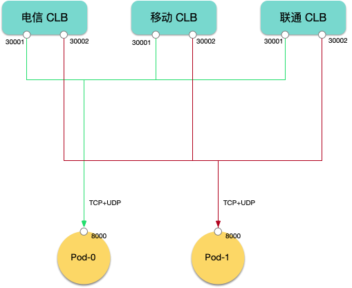

# 使用 CLB 端口池为 Pod 映射公网地址

## 创建端口池 (CLBPortPool)

```yaml
apiVersion: networking.cloud.tencent.com/v1alpha1
kind: CLBPortPool
metadata:
  name: pool-test
spec:
  startPort: 30000 # 端口池中 CLB 起始端口号
  exsistedLoadBalancerIDs: [lb-04iq85jh] # 指定已有的 CLB 实例 ID，可动态追加
  autoCreate:
    enabled: true # 是否启用在 CLB 端口不足时自动创建 CLB
```

## 指定 Pod 注解

在 Pod Template 中指定注解，声明从 CLB 端口池为 Pod 分配公网地址映射，可以是任意类型的工作负载，比如：
1. Kubernetes 自带的 Deployment、Statusfulset。
2. OpenKruise 的 Advanced Deployment 或 Advanced Statusfulset。
3. 开源的游戏专用工作负载，如 OpenKruiseGame 的 GameServerSet、Agones 的 Fleet。

下面以 OpenKruiseGame 的 GameServerSet 为例，指定 Pod 注解：

```yaml
apiVersion: game.kruise.io/v1alpha1
kind: GameServerSet
metadata:
  name: gameserver
  namespace: default
spec:
  replicas: 3
  updateStrategy:
    rollingUpdate:
      podUpdatePolicy: InPlaceIfPossible
  gameServerTemplate:
    annotations:
        networking.cloud.tencent.com/enable-clb-port-mapping: "true"
        networking.cloud.tencent.com/clb-port-mapping: |-
          8000 UDP pool-test
    spec:
      containers:
        - image: your-gameserver-image
          name: gameserver
```

1. 指定注解 `networking.cloud.tencent.com/enable-clb-port-mapping` 为 `true` 开启使用 CLB 端口池为 Pod 映射公网地址。
2. 指定注解 `networking.cloud.tencent.com/clb-port-mapping` 配置映射规则，`8000 TCP pool-test`，其中 `8000` 表示 Pod 监听的端口号，`UDP` 表示端口协议（支持 TCP、UDP 和 TCPUDP），`pool-test` 表示 CLB 端口池名称，可指定多行配置多个端口映射。

## TCP 和 UDP 同时接入

有些情况下，玩家的网络环境 UDP 可能无法正常工作，游戏客户端自动 fallback 到 TCP 协议进行通信。

用 CLB 端口池为 Pod 映射公网地址时，可以同时监听 TCP 和 UDP 协议，最终映射的公网地址 TCP 和 UDP 使用相同端口号。

配置方法是在 Pod 注解中指定端口协议时使用 `TCPUDP` 即可：

```yaml
annotations:
    networking.cloud.tencent.com/clb-port-mapping: |-
      8000 TCPUDP pool-test
```

映射效果如下：


> Pod 的一个端口同时监听 TCP 和 UDP 协议，CLB 映射公网地址时，会分别使用 TCP 和 UDP 两个相同端口号的不同监听器进行映射。

## 多线接入

CLB 默认使用 BGP 多运营商接入，带宽成本较高，游戏场景通常要消耗巨大的带宽资源，为节约成本，可以考虑使用 CLB 的单线接入，通过多个 CLB 来实现多线接入（电信玩家连上电信 CLB，联通玩家连上联通 CLB，移动玩家连上移动 CLB），这样可以节约大量带宽成本。

下面介绍配置方法，首先创建多个端口池，一个运营商一个端口池，这里以电信、联通、移动三个运营商为例，创建各自的 CLB 端口池：

```yaml
apiVersion: networking.cloud.tencent.com/v1alpha1
kind: CLBPortPool
metadata:
  name: pool-ctcc # 电信 CLB 端口池
spec:
  startPort: 30000 # 端口池中 CLB 起始端口号
  exsistedLoadBalancerIDs: [lb-04i895jh, lb-04i87jjk] # 指定已有的电信 CLB 实例 ID，可动态追加
  autoCreate:
    enabled: true # 电信 CLB 端口不足时自动创建电信 CLB
    parameters: # 指定电信 CLB 创建参数
      vipIsp: CTCC # 指定运营商为电信
      bandwidthPackageId: bwp-40ykow69 # 指定电信带宽包 ID
---
apiVersion: networking.cloud.tencent.com/v1alpha1
kind: CLBPortPool
metadata:
  name: pool-cmcc # 移动 CLB 端口池
spec:
  startPort: 30000 # 端口池中 CLB 起始端口号
  exsistedLoadBalancerIDs: [lb-jjgsqldb, lb-08jk7hh] # 指定已有的移动 CLB 实例 ID，可动态追加
  autoCreate:
    enabled: true # 移动 CLB 端口不足时自动创建电信 CLB
    parameters: # 指定移动 CLB 创建参数
      vipIsp: CMCC # 指定运营商为移动
      bandwidthPackageId: bwp-97yjlal5 # 指定移动带宽包 ID
---
apiVersion: networking.cloud.tencent.com/v1alpha1
kind: CLBPortPool
metadata:
  name: pool-cucc # 联通 CLB 端口池
spec:
  startPort: 30000 # 端口池中 CLB 起始端口号
  exsistedLoadBalancerIDs: [lb-cxxc6xup, lb-mq3rs6h9] # 指定已有的移动 CLB 实例 ID，可动态追加
  autoCreate:
    enabled: true # 联通 CLB 端口不足时自动创建电信 CLB
    parameters: # 指定联通 CLB 创建参数
      vipIsp: CUCC # 指定运营商为联通
      bandwidthPackageId: bwp-97yjlal5 # 指定联通带宽包 ID
```

然后在 Pod 注解中配置端口映射：

```yaml
apiVersion: game.kruise.io/v1alpha1
kind: GameServerSet
metadata:
  name: gameserver
  namespace: default
spec:
  replicas: 2
  updateStrategy:
    rollingUpdate:
      podUpdatePolicy: InPlaceIfPossible
  gameServerTemplate:
    annotations:
        networking.cloud.tencent.com/enable-clb-port-mapping: "true"
        networking.cloud.tencent.com/clb-port-mapping: |-
          8000 TCPUDP pool-ctcc,pool-cmcc,pool-cucc useSamePortAcrossPools
    spec:
      containers:
        - image: your-gameserver-image
          name: gameserver
```

映射效果如下：




解释：

1. Pod 端口同时监听 TCP 和 UDP，映射规则中的协议指定为 `TCPUDP`，CLB 映射公网地址时，会分别使用 TCP 和 UDP 两个相同端口号的不同监听器进行映射。
2. 使用多个端口池进行映射，用逗号隔开，每个端口池分别都会为 Pod 映射各自公网地址。
3. 追加 useSamePortAcrossPools 选项表示最终每个端口池分配相同的端口号。
4. 综上，最终每个 Pod 的每个端口会被映射三个公网地址，算上 TCP 和 UDP 同时监听，每个 Pod 端口使用 6 个 CLB 监听器映射公网地址；玩家连上自己运营商对应的 CLB 映射地址，如果玩家的网络环境 UDP 无法正常工作，自动 fallback 到 TCP 协议进行通信。

## CRD 字段参考

关于 CRD 字段的详细说明，请参考 [API 参考](./api.md)。
